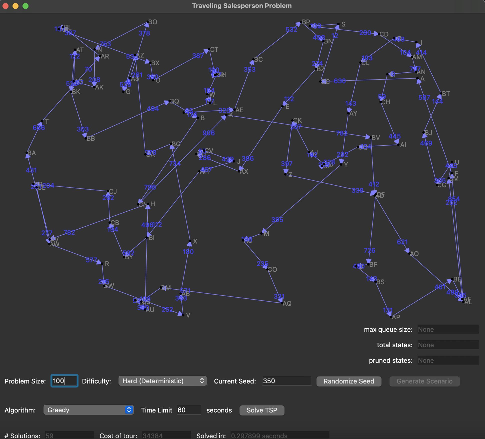

# Travelling Salesperson Project

## Project Description
An implementation of a branch and bound algorithm as well as a greedy algorithm to solve the classic
travelling salesperson problem. The branch and bound algorithm has an average runtime complexity of 
O(n^2 * b^n) where n is the number of cities and b is the average number of partial states in the 
priority queue. The greedy algorithm has a runtime complexity of O(n^3). The branch and bound algorithm
is guaranteed to find the optimal solution, as long as it doesn't go over the time limit specified by 
the user. The greedy solution is not guaranteed to be optimal, although with small sample sizes (n<~10)
it can sometimes find the optimal solution. The problem has 3 different difficulties: easy, where the
distances between cities are symmetric, normal, where the the distances between cities are asymmetric,
and hard, where the distances between cities are asymmetric and 20% of the distances are set to infinity
(these edges are chosen at random). It also has a hard deterministic difficulty, which is the same as the 
hard difficulty, but edges set to infinity are reliant on the random seed. This mode is used for testing
and validation.\
\

## How to Use
To use, you must first have Python and PyQt5 installed. Then, you can clone this repository to your local machine and run the Proj5GUI.py to get started. Upon running that file, you should see a screen similar to the one above. 
From the starting screen, you can specify the number of cities, the difficulty and the random seed. Once these values are chosen,
you can click the generate scenario button to display the cities on the screen. From there you can specify which
algorithm you would like to use: random, greedy or branch and bound. You can also specify the maximum time that 
you would like the algorithm to run. If an algorithm times out, it will return the best solution found thus far.
Finally, you can click the solve TSP button and it will find the solution using the algorithm specified. It will
also ouput how many solutions were found, the cost of the best solution's route, and the time it took to find the 
best solution.